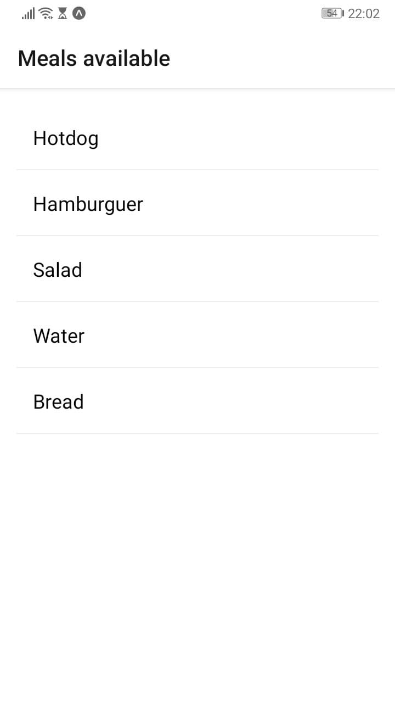

# meals-app
Small app to make meals orders from a list, made with react native

Basic features:

* Authentication: register and login
* Consumes REST API to display available meals
* Allows to create new orders selecting a meal

