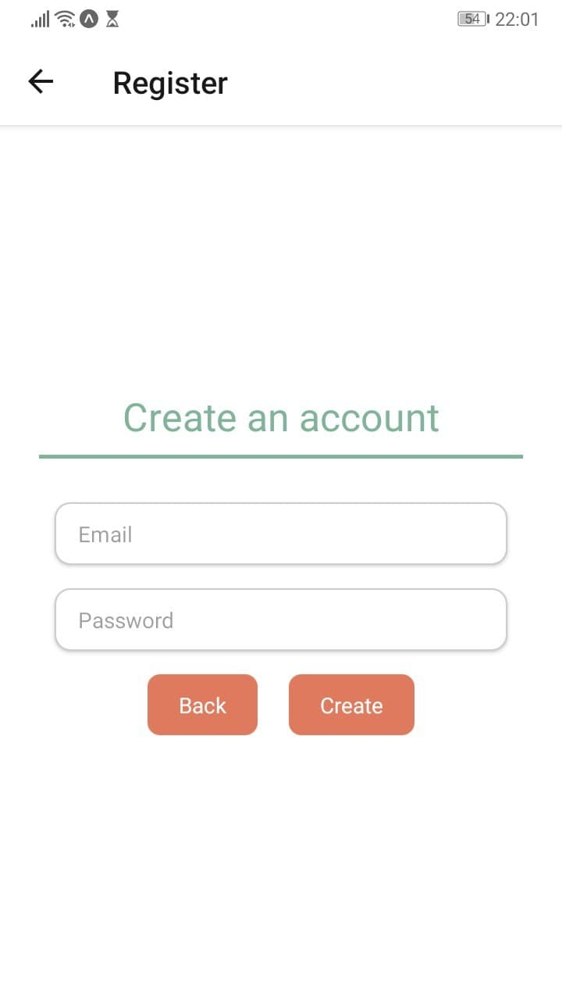

# meals-app
Small app to make meals orders from a list, made with react native

Basic features:

* Authentication: register and login
* Consumes REST API to display available meals
* Allows to create new orders selecting a meal





## backend/ : serverless API

Serverless API deployed to Vercel

Is connected to a mongoDB to hosts user and all the backend

---

### API REST architecture

It's mainly composed by:

* **Client** (react native app)
* **API** (express server)
* **Database** (MongoDB)

The client communicates with the database throw our API 

````
Method         URL                   Status

GET    List    /users or /users/:id  200
POST   Create  /users                201
PUT    Replace /users/:id            204
PATCH  Update  /users/:id            204
DELETE Delete  /users/:id            204
````


### Serverless (FaaS - Function as a Service)

The service loads our files when a client asks for them

After some time, it unloads the files from memory and let them stored on a database

This allows to share the server resources with a lot of clients, and the server will auto manage itself automatically, without need a sysadming managing the server load.
